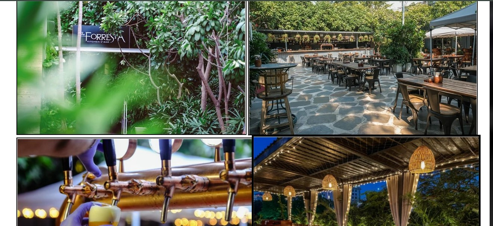
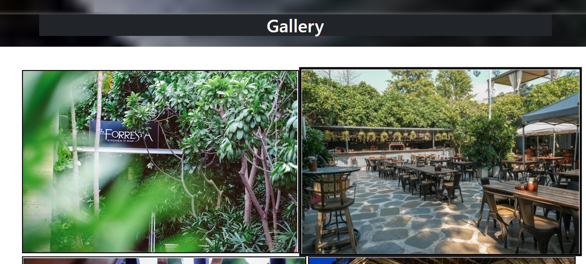
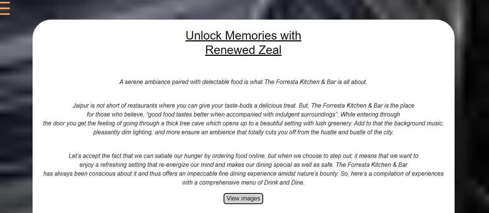
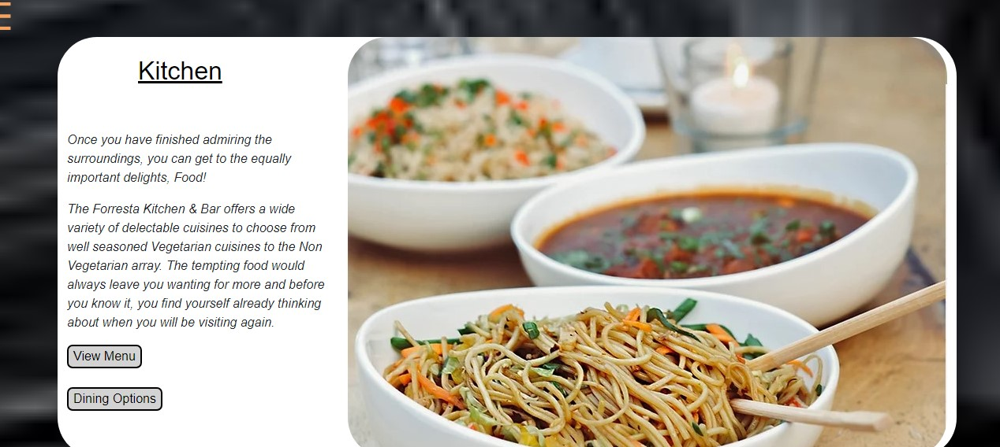

# Forresta Restaurant and Bar Clone

Welcome to the clone repository of the Forresta Restaurant and Bar website. This project is a recreation of the original website which can be found [here](https://www.theforrestakitchenbar.com/). The clone is built using PHP, HTML, CSS, JavaScript, jQuery, and Bootstrap.

## About

This project aims to provide a replica of the Forresta Restaurant and Bar website to demonstrate web development skills and technologies. The clone includes all the main features and design elements of the original website.

## Features

- Responsive design using Bootstrap
- Interactive UI elements with JavaScript and jQuery
- Backend functionality with PHP
- Styled using CSS to match the original design

## Technologies Used

- **HTML**: Structure of the web pages
- **CSS**: Styling and layout
- **JavaScript**: Interactive elements
- **jQuery**: Simplified JavaScript operations
- **Bootstrap**: Responsive design framework
- **PHP**: Server-side scripting

## Usage

Explore the website to see the cloned features and design. The website includes different sections such as the home page, menu, reservations, and contact form. Each section is fully functional and replicates the original website's behavior.

## Screenshots

Include screenshots of the website to showcase its design and functionality. For example:

</img>
</img>
</img>
</img>

## Contributing

Contributions are welcome! If you have any suggestions or improvements, feel free to create a pull request or open an issue.

1. Fork the repository
2. Create your feature branch (`git checkout -b feature/YourFeature`)
3. Commit your changes (`git commit -m 'Add YourFeature'`)
4. Push to the branch (`git push origin feature/YourFeature`)
5. Open a pull request

## License

Distributed under the MIT License. See `LICENSE` for more information.

## [+] Find Me On :

## Visiter

